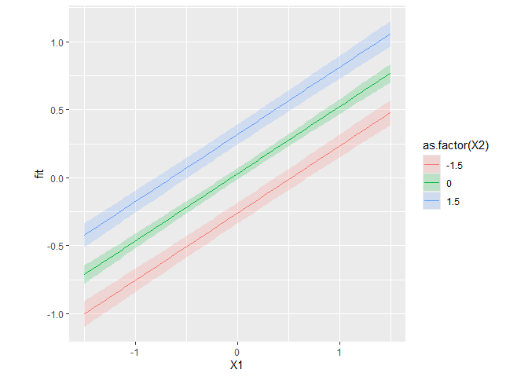
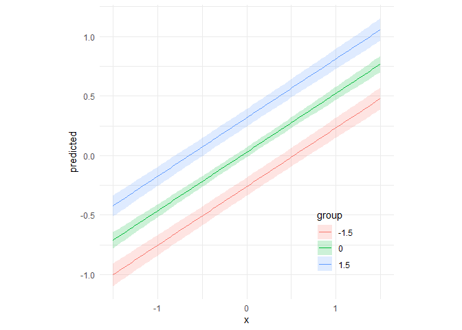

Fast predictions from glmmTMB models
================

This repository contains a single function, `predict_delta_glmmTMB`,
which returns predicitons and confidence intervals for model predictions
fitted with glmmTMB. Confidence intervals are computed using the Delta
method. The function is much faster and uses less memory than
`ggeffects::ggpredict`, but does not perform any checks.

## Example

1.  Fake data

``` r
set.seed(2)
n = 100

# covariates
data = replicate(2, rnorm(n, 0,1))

# parameters
b = c(0.5, 0.2)
sd = 0.2

# response
y = 0 + data %*% b + rnorm(n, sd = sd)
data = data.frame(y = y, data)
```

2.  Fit model

<!-- -->

    ## Warning in checkDepPackageVersion(dep_pkg = "TMB"): Package version inconsistency detected.
    ## glmmTMB was built with TMB version 1.9.11
    ## Current TMB version is 1.9.17
    ## Please re-install glmmTMB from source or restore original 'TMB' package (see '?reinstalling' for more information)

3.  Generate predictions

``` r
source('glmmTMB_predict_delta.R')

#newdata
newdata <- expand.grid(X1 = seq(-1.5, 1.5, length.out = 100),
                       X2 = c(-1.5, 0, 1.5))


pred <- predict_delta_glmmTMB(m, newdata)
head(pred)
```

    ##          X1   X2        fit  conf_low  conf_high conf_level
    ## 1 -1.500000 -1.5 -1.0013423 -1.095960 -0.9067242       0.95
    ## 2 -1.469697 -1.5 -0.9863839 -1.080365 -0.8924025       0.95
    ## 3 -1.439394 -1.5 -0.9714256 -1.064779 -0.8780725       0.95
    ## 4 -1.409091 -1.5 -0.9564673 -1.049200 -0.8637343       0.95
    ## 5 -1.378788 -1.5 -0.9415090 -1.033631 -0.8493874       0.95
    ## 6 -1.348485 -1.5 -0.9265507 -1.018069 -0.8350319       0.95

4.  Create plot

``` r
library(ggplot2)
(pred_plot <- ggplot(pred, aes(x = X1, y = fit)) +
  geom_line(aes(colour = as.factor(X2))) +
  geom_ribbon(aes(fill = as.factor(X2), ymin = conf_low, ymax = conf_high), alpha = 0.2) + 
  theme_minimal() + 
  theme(aspect.ratio = 1,
        legend.position = 'inside',
        legend.position.inside = c(0.8, 0.2)))
```

<!-- -->

5.  Compare to `ggeffects::ggpredict`

``` r
library(ggeffects)
pred_ggpredict <- data.frame(ggpredict(m, newdata))

(pred_plot_ggeffects <- ggplot(pred_ggpredict, aes(x = x, y = predicted)) +
  geom_line(aes(colour = group)) +
  geom_ribbon(aes(fill = group, ymin = conf.low, ymax = conf.high), alpha = 0.2) + 
  theme_minimal() + 
  theme(aspect.ratio = 1,
        legend.position = 'inside',
        legend.position.inside = c(0.8, 0.2))) 
```

<!-- -->
